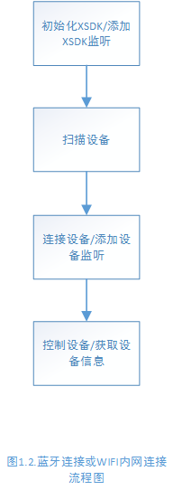
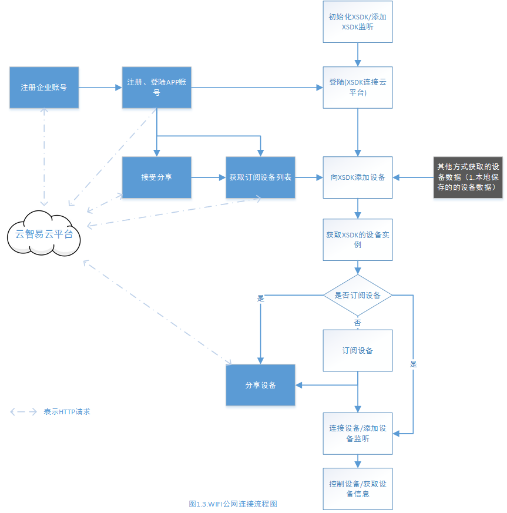
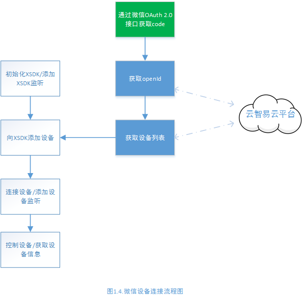
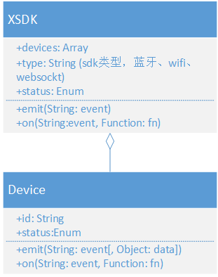

# xlink jssdk 开发者文档
本文档是面向智能硬件的H5应用开发者，通过xlink jssdk接入云智易物联平台。支持WIFI、蓝牙和微信应用开发，其中WIFI和蓝牙开发需要[容器](#container)的支持。

- [应用环境](#env)
- [接口文档](#document)
- [调试工具](#debug)

##<a name='env'>jssdk 应用环境</a>

 - [蓝牙和WIFI(内网环境)](#env-bluetooth)
 - [WIFI(公网环境)](#env-wifi)
 - [微信应用环境](#env-wechat)

### <a name='env-bluetooth'>蓝牙和WIFI(内网环境)</a>
流程如下图1.2



代码示例：
```
var XSDK = require('xsdk') // 独立版本不需要这一句

// 初始化实例
var bt = new XSDK('bluetooth')

bt.on('ready', function () {
    // 扫描设备
    bt.emit('startscan')
})
.on('devicesready', function (devices) {
    // devices 表示扫描出的的设备数组
    devices.forEach(function (item) {
        // 连接设备
        item.emit('connect')
        // 添加设备监听
        item.on('connect', function (msg) {
            // msg 表示连接成功的描述
            item.emit('senddata', '')
            item.emit('disconnect')
        })
        .on('data', function (data) {
            // data 表示设备返回的数据
        })
        .on('disconnect', function (msg) {
            // msg 表示断开成功的描述
        })
        .on('error', function (error) {
            // error 表示错误信息描述
        })
    })
})
.on('timeout', function (msg) {
    // msg 表示超时的描述
})
.on('error', function (error) {
    // error 表示错误信息描述
})
```

### <a name='env-wifi'>WIFI(公网环境)</a>
流程如下图1.3



代码示例：
### <a name='env-wechat'>微信应用环境</a>
流程如下图1.4



 1. [通过微信OAuth 2.0接口获取用户认证Code](http://example)
 2. [获取用户OpenID接口](http://example)
 3. [获取用户绑定设备列表](http://example)

代码示例：

```
var XSDK = require('xsdk') // 独立版本不需要这一句

// 通过微信OAuth 2.0接口获取用户认证Code
// code

// 获取用户OpenID接口，通过Code换取OpenID，同时得到XLINK平台用户ID
// code

// 获取用户绑定设备列表
// code

// 初始化实例
var ws = new XSDK('websocket', { // xsdk微信应用接口的是基于socket.io实现的。
        type: 'remote',
        host: 'cm.xlink.cn:23777',
        userid: '' // 微信用户在云智易平台的user_id，通过获取OpenID接口获取
    })

ws.on('ready', function () {
    ws.emit('adddevices', _devices) //_devices 表示用户绑定设备列表
})
.on('devicesready', function (devices) {
    // devices 表示扫描出的的设备数组
    devices.forEach(function (item) {
        // 连接设备
        item.emit('connect')
        // 添加设备监听
        item.on('connect', function (msg) {
            // msg 表示连接成功的描述
            item.emit('senddata', '')
            item.emit('disconnect')
        })
        .on('data', function (data) {
            // data 表示设备返回的数据
        })
        .on('disconnect', function (msg) {
            // msg 表示断开成功的描述
        })
        .on('error', function (error) {
            // error 表示错误信息描述
        })
    })
})
.on('timeout', function (msg) {
    // msg 表示超时的描述
})
.on('error', function (error) {
    // error 表示错误信息描述
})
```


----------

## <a name='document'>接口文档</a>
下图是JS SDK的UML类图

## <a name='xsdk'>Class XSDK</a>
JS SDK 在window下暴露了一个全局的XSDK类，根据构造函数参数，返回不同的连接实例，每个连接（蓝牙或者WIFI）维护一个实例。

### 属性 ###
| 类型 | 属性 | 描述 |
| --- | --- | --- |
| String | type | 实例的类型  ['bluetooth'](#bluetooth) ['wifi'](#wifi) 或 ['websocket'](#websocket)|
| Array | devices | Device类型数组 |
| Number | status | 设备状态 0 表示未连接，1表示正在连接， 2表示已连接|

### 构造函数 ###
| 构造函数 | 描述 |
| --- | --- |
| XSDK (String type[, Object option]) | 返回一个连接实例 |

####构造函数参数说明
| 参数 | 类型 | 是否必须 | 描述 |
| --- | --- | --- | --- |
| type | String | 是 | ['bluetooth'](#bluetooth) ['wifi'](#wifi) 或 ['websocket'](#websocket) |
| option | Object | type为['websocket'](#websocket)时必须 | 根据使用环境不同 option有不同参数结构 |

微信应用环境下 option 参数结构：

```
    {
        type: '', // 固定为remote
        host: '', // 固定为cm.xlink.cn:23777
        userid: '' // 微信用户在云智易平台的user_id，通过获取OpenID接口获取
    }
```

### 实例方法
| 方法 | 描述 |
| --- | --- |
| [emit(String event[, Object/Array option])](#sdkemit) | 触发事件 |
| [on(String event, Function cb)](#sdkon) | 监听事件 |

####<a name = 'sdkemit'>emit参数</a>
| 参数 | 类型 | 是否必须 | 描述 |
| --- | --- | --- | --- |
| event | String | 是 | 支持的发送事件有 ['startscan'](#STARTSCAN) ['cancelscan'](#CANCELSCAN) ['destory'](#DESTORY) ['adddevices'](#ADDDEVICES)|
| option | Object/Array | 只在触发事件为 ['adddevices'](#ADDDEVICES)添加 | 表示一个或者多个设备必要信息|

微信应用 触发 adddevices 事件时添加的 option 参数结构：
```
    [
        {
            deviceid: '1725034861', // 微信用户在云智易平台的绑定的设备id，通过获取设备列表接口获取
            userid: '1153087813', // 微信用户在云智易平台的user_id，通过获取OpenID接口获取
            token: '1153087813' // 保留字段，未实现
        }
        ...
    ]
```

####<a name = 'sdkon'>on参数</a>
| 参数 | 类型 | 是否必须 | 描述 |
| --- | --- | --- | --- |
| event | String | 是 | 支持的发送事件有 [''ready](#READY) ['devicesready'](#DEVICESREADY) ['statuschange'](#STATUSCHANGE) ['error'](#ERROR)|
| cb | Function | 是 | 回调函数 |


----------


## <a name='device'>Class Device</a>
Device类表示设备。每一个Device实例根据设备id(device_id)唯一标识一个设备。设备实例由
[XSDK](#xsdk)实例创建
### 属性
| 类型 | 属性 | 描述 |
| --- | --- | --- |
| String | id | 设备id |
| Number | status | 设备状态 0表示离线 1表示在线 |

### 方法
| 方法 | 描述 |
| --- | --- |
| [emit(String event[, String data])](#deviceemit) | 触发事件 |
| [on(String event, Function cb)](#deviceon) | 监听事件 |

####<a name = 'deviceemit'>emit参数</a>

| 参数 | 类型 | 是否必须 | 描述 |
| --- | --- | --- | --- |
| event | String | 是 | 支持的发送事件有 ['connect'](#CONNECT) ['disconnect'](#DISCONNECT) ['senddata'](#SENDDATA) ['setdatapoint'](#SETDATAPOINT)|
| data | String | 仅在event为['senddata'](#SENDDATA)时添加 | 发送的指令内容 |

####<a name = 'deviceon'>on参数</a>
| 参数 | 类型 | 是否必须 | 描述 |
| --- | --- | --- | --- |
| event | String | 是 | 支持的发送事件有 ['connect'](#CONNECT) ['disconnect'](#DISCONNECT) ['data'](#DATA) ['error'](#ERROR)|
| cb | Function | 是 | 回调函数 |


----------


##events

| 事件 | 描述 |
| --- | --- |
| <a name='CONNECT'>connect</a> | 连接设备 |
| <a name='DISCONNECT'>disconnect</a> | 断开设备连接 |
| <a name='SETDATAPOINT'>setdatapoint</a> | 设置设备datapoint |
| <a name='DATA'>data</a> | 设备数据更新，事件触发时会将设备数据传入回调函数 |
| <a name='SUBSCRIBE'>subscribe</a> | 订阅设备 |
| <a name='UNSUBSCRIBE'>unsubscribe</a> | 取消订阅设备 |
| <a name='SENDDATA'>senddata</a> | 发送设备数据 |
| <a name='READY'>ready</a> | SDK 就绪，可以扫描设备 |
| <a name='STATUSCHANGE'>statuschange</a> | SDK 或者 设备状态 |
| <a name='STARTSCAN'>startscan</a> | 开始扫描设备 |
| <a name='ADDDEVICES'>adddevices</a> | 添加设备 |
| <a name='CANCELSCAN'>cancelscan</a> | 取消扫描设备 |
| <a name='DEVICESREADY'>devicesready</a> | 表示扫描设备或添加设备完成 |
| <a name='DESTORY'>destory</a> | 销毁一个连接实例 |
| <a name='ERROR'>error</a> | 错误 |


----------


##type

| 属性 | 描述 |
| --- | --- |
| <a name='wifi'>wifi</a> | wifi 连接 |
| <a name='wifi'>bluetooth</a> | 蓝牙连接 |
| <a name='wifi'>websocket</a> | websocket连接，微信环境使用该接口 |


----------


## <a name='debug'>调试工具</a>
| 调试工具 | 适用平台 | 优点 | 缺点 |
| --- | --- | --- | --- |
| [weinre](http://people.apache.org/~pmuellr/weinre/docs/latest/Home.html) | android/ios/微信 | 全平台通用 | 操作相对比较繁杂，无法检测websokect协议 |
| [chrome devtool](https://developers.google.com/chrome-developer-tools/docs/remote-debugging) | android(chrome浏览器，基于webview构建的页面 | 操作简单，chrome devtool 调试效果佳 | 适用平台有限 |
| [微信web开发者工具](https://mp.weixin.qq.com/wiki/10/e5f772f4521da17fa0d7304f68b97d7e.html) | 微信 | 类似chrome devtool 远程调试的操作方法，微信开发的首选 | 适用平台有限 |

###weinre

*weinre* 是一款基于Web Inspector(Webkit)的远程调试工具，以下是weinre的简单安装使用方法 (如果与[weinre官方文档](http://people.apache.org/~pmuellr/weinre/docs/latest/Home.html)出现冲突，以官方文档为准)
####[安装](http://people.apache.org/~pmuellr/weinre/docs/latest/Installing.html)

```
$ sudo npm -g install weinre
```

####[运行](http://people.apache.org/~pmuellr/weinre/docs/latest/Running.html)
option 选项详情见官方文档
```
$ weinre --boundHost -all- --httpPort 8081 --reuseAddr true --readTimeout 1 --deathTimeout 5
```
 - weinre调试的关键步骤是在待调试页面嵌入一段js实现与weinre服务端的通信
```
 <script src="http://192.168.2.100:8081/target/target-script-min.js#anonymous"></script>
```
 - 在pc浏览器中打开 http://192.168.2.100:8081/client/#anonymous 即可以调试页面, anonymous是一个连接标识，可以自己指定


----------


##名词解释
| 名词 | 解释 |
| --- | --- |
|<a name="container">容器| 在混合应用程序(hybird app)中 ，开发人员可以把HTML5应用程序嵌入到一个细薄的原生容器里面，容器即是一个简单的native app |
